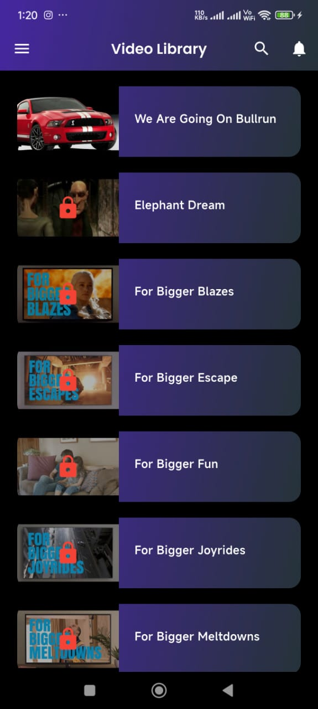
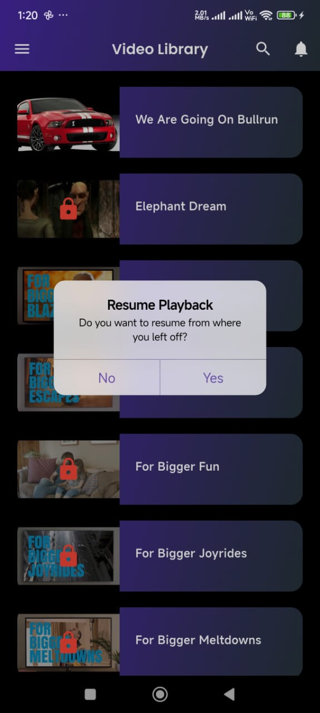
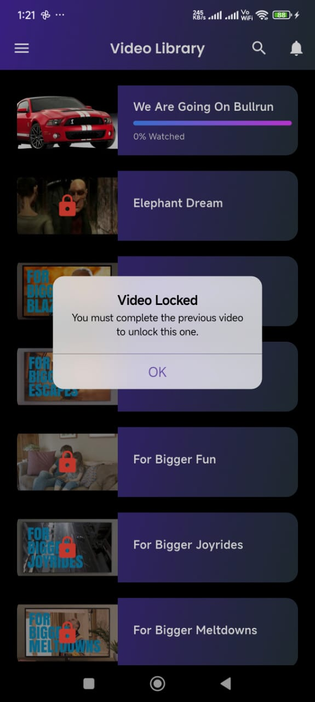

# Video Player App

## Overview
This is a Flutter-based video player application that allows users to watch videos with progress tracking, video locking (sequential unlocking), and a modern UI with gradient designs.

## Features
- **Video Playback**: Play videos from a network source using `video_player`.
- **Progress Tracking**: Saves and restores video progress using `SharedPreferences`.
- **Sequential Unlocking**: Users must complete a video before unlocking the next one.
- **Gradient UI**: Stylish card and app bar designs with gradient effects.
- **Fullscreen Support**: Toggle fullscreen mode with immersive experience.
- **Provider State Management**: Handles video progress tracking efficiently.

## Installation
1. **Clone the Repository**
   ```bash
   git clone https://github.com/Appu-Devloper/video_player.git
   cd video-player-app
   ```

2. **Install Dependencies**
   ```bash
   flutter pub get
   ```

3. **Run the App**
   ```bash
   flutter run
   ```

## Dependencies
Make sure you have the following dependencies in your `pubspec.yaml`:
```yaml
dependencies:
  flutter:
    sdk: flutter
  provider: ^6.0.5
  video_player: ^2.6.1
  shared_preferences: ^2.2.0
  google_fonts: ^6.1.0
```

## Project Structure
```
/lib
  ├── Models
  │   ├── video_model.dart
  │   └── datasource.dart
  ├── Screens
  │   ├── video_list_screen.dart
  │   └── video_player_screen.dart
  ├── Services
  │   └── video_provider.dart
  ├── Widgets
  │   └── customappbar.dart
  ├── main.dart
```

## How It Works
1. **Video List Screen**
   - Displays a list of videos.
   - Shows video progress with a gradient progress bar.
   - Locks videos until the previous one is completed.

2. **Video Player Screen**
   - Plays selected video from a network URL.
   - Supports pause/play by tapping the screen.
   - Displays video progress and duration.
   - Enables fullscreen mode.

3. **State Management**
   - Uses `Provider` to store video progress and total duration.
   - Saves progress to `SharedPreferences` for persistence.

## Screenshots




## Future Enhancements
- **Offline Video Support**
- **Custom Video Speed Control**
- **Dark/Light Mode Switching**

## License
This project is open-source and available under the MIT License.

---
Happy Coding! 🚀

